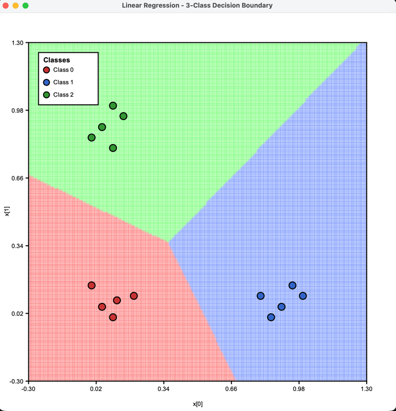
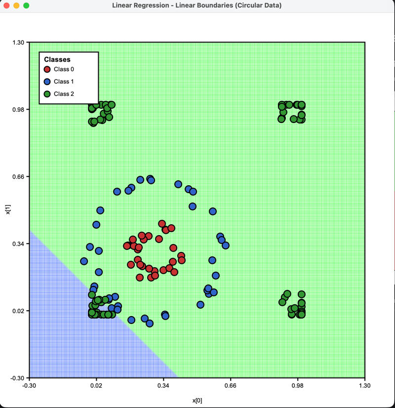
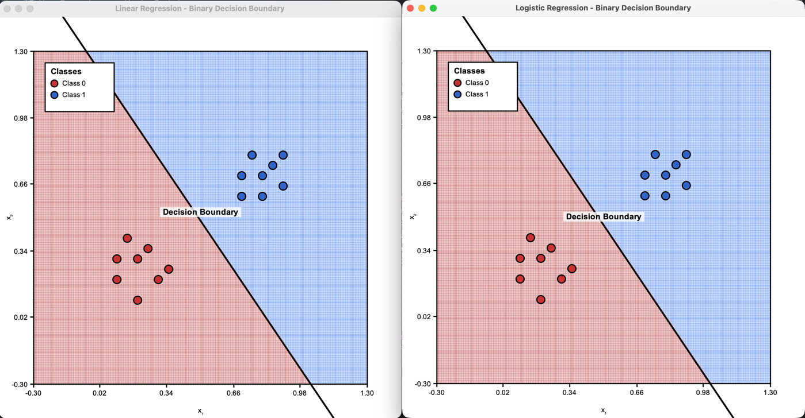
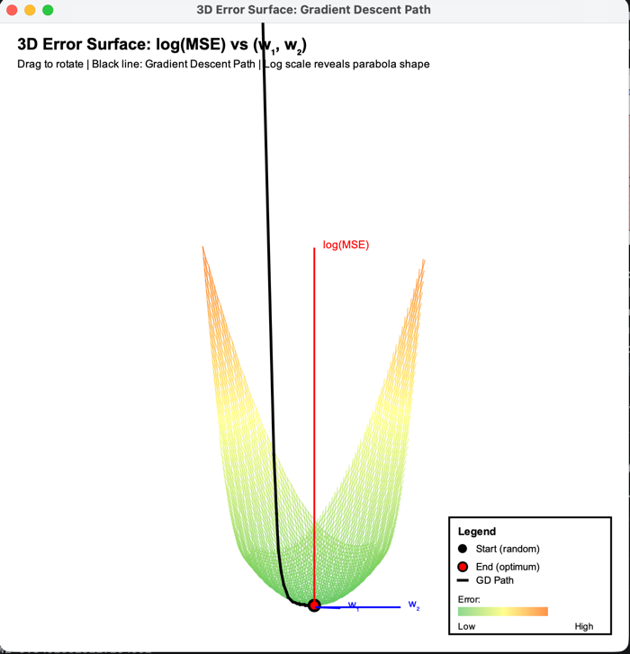
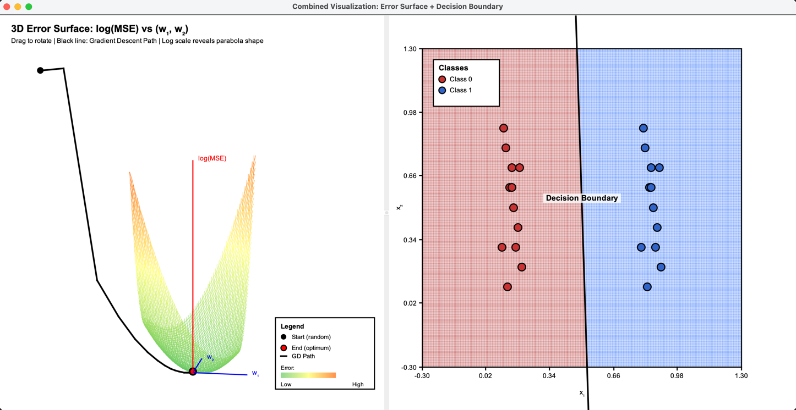

# Fundamentals of (Multiple) Linear Regression & Logistic Regression


This project contains a comprehensive Java implementation of **Linear Regression** and **Logistic Regression**, featuring:
- Gradient Descent (For Linear and Logistic Regression) and Closed-Form solutions for Linear Regression
- Visualization tools, including **3D error surface plots** for intuitive understanding
- Practical examples demonstrating performance trade-offs and best practices

These implementations recap the theoretical and practical foundations I explored during my studies and my time affiliated with the **Institute of Neuroinformatics at ETH Zürich**.


Everything's written in plain Java with interactive visualizations for all 2D classification problems. **It's built for learning, experimenting, and really getting how regression work under the hood**.


## Table of Contents

1. [Overview](#overview)
2. [Mathematical Theory](#mathematical-theory)
3. [Implementation Details](#implementation-details)
4. [Examples & Visualizations](#examples--visualizations)
5. [Usage Guide](#usage-guide)
6. [Comparison of Approaches](#comparison-of-approaches)

---

## Overview

This project implements two fundamental machine learning algorithms from scratch in Java:

- **Linear Regression** - For regression tasks (ideally continuous outputs but I also use it for classification of labels in oneHot encoding)
- **Logistic Regression** - For classification tasks (categorical outputs)

Each implementation includes:
- Training via gradient descent (and closed-form solution for Linear Regression)
- Prediction capabilities
- Visualization of decision boundaries
- 1 example shows a liniar regression for a binary classification (with 2-dimensional weight vector) that plots the error surface

---

## Mathematical Theory

### 1. Linear Regression

**Purpose**: Predict continuous values

**Model**:
```
ŷ = w₀ + w₁x₁ + w₂x₂ + ... + wₙxₙ
```

Where:
- `ŷ` = predicted output
- `w₀` = bias term
- `wᵢ` = weight for feature i
- `xᵢ` = input feature i

**Loss Function** (Mean Squared Error):
```
MSE = (1/N) Σ(yᵢ - ŷᵢ)²
```

**Gradient Descent Update**:
```
wⱼ := wⱼ - α · ∂MSE/∂wⱼ
```

Where:
```
∂MSE/∂wⱼ = (2/N) Σ(ŷᵢ - yᵢ) · xᵢⱼ
```

**Closed-Form Solution** (Normal Equation):
```
β = (X^T X)^(-1) X^T y
```

Where:
- `X` = design matrix (with bias column)
- `y` = target vector
- `β` = optimal weights

**Key Properties**:
- Creates **linear decision boundaries** (straight lines/hyperplanes)
- Convex optimization problem (single global minimum)
- Error surface is a parabola (quadratic function)

---

### 2. Logistic Regression

**Purpose**: Binary and multi-class classification

**Model**:
```
z = w₀ + w₁x₁ + w₂x₂ + ... + wₙxₙ
P(class k) = softmax(z)ₖ = exp(zₖ) / Σⱼ exp(zⱼ)
```

**Softmax Function** (for multi-class):
```
P(y = k | x) = exp(wₖ^T x) / Σⱼ exp(wⱼ^T x)
```

**Loss Function** (Cross-Entropy):
```
L = -(1/N) Σᵢ Σₖ yᵢₖ · log(P(yᵢ = k | xᵢ))
```

**Gradient**:
```
∂L/∂wⱼ = (1/N) Σᵢ (P(yᵢ | xᵢ) - yᵢ) · xᵢⱼ
```

**Key Properties**:
- Creates **linear decision boundaries** (like Linear Regression)
- Outputs are **valid probabilities** (sum to 1.0)
- **No closed-form solution** due to non-linear activation
- Must use iterative optimization (gradient descent)
- Due to the linear nature, also a convex optimization problem (with a single global minimum)

---

## Implementation Details

### Gradient Descent

**Basic Algorithm**:
```java
for (int iter = 0; iter < maxIterations; iter++) {
    // 1. Forward pass: compute predictions
    double[] predictions = predict(X);
    
    // 2. Compute error
    double[] errors = predictions - Y;
    
    // 3. Compute gradients
    gradients = (1/N) * X^T * errors;
    
    // 4. Update weights
    weights -= learningRate * gradients;
}
```

**Learning Rate**: Controls step size
- Too large: Oscillation, divergence
- Too small: Slow convergence
- Typical values: 0.01 - 0.5

**Convergence**: Monitor MSE/loss over iterations

---

### Error Surface Geometry

For linear regression with 2 features (w₁, w₂):

**Error Surface**:
```
MSE(w₁, w₂) = (1/N) Σ(yᵢ - (w₀ + w₁x₁ᵢ + w₂x₂ᵢ))²
```

This is a **quadratic function** → creates a parabolic "bowl" in 3D

**Properties**:
- Single global minimum (convex optimization)
- Gradient points toward minimum
- Gradient descent follows steepest descent path
- Curvature depends on data distribution:
    - Symmetric data → symmetric bowl
    - Correlated features → elongated valley

**Visualization**:
- X-axis: w₁ values
- Y-axis: w₂ values
- Z-axis: MSE (error)
- Gradient descent path: black line from random start to minimum (red dot)

---

## Examples & Visualizations

### 1. Linear Regression Examples

#### **LinearRegressionExample3Region.java**

- **Purpose**: Demonstrate linear regression for classification
- **Dataset**: 3 spatial regions with different target values
- **Visualization**: BoundaryPanelMulti shows classification regions
- **Key Insight**: Linear regression can approximate classification but outputs aren't probabilities


#### **LinearRegressionCircularExample.java**

- **Purpose**: Show linear regression limitations on non-linear data
- **Dataset**: Circular/ring pattern (3 concentric regions)
- **Visualization**: Decision boundaries (will be linear)
- **Key Insight**: Linear boundaries fail on circular data


#### **LinearRegressionComparisonExample.java**
- **Purpose**: Compare gradient descent vs closed-form solution
- **Methods**:
    1. Gradient Descent (iterative, ~2000 iterations)
    2. Normal Equation (direct calculation)
- **Key Insight**: Both reach same solution; closed-form is faster for small datasets.  
  **When to use each:**

| Feature            | Gradient Descent      | Closed-Form          |
|--------------------|-----------------------|-----------------------|
| **Speed (small n)**| Slower               | Faster               |
| **Speed (large n)**| Faster               | Slower (O(n³)!)      |
| **Accuracy**       | Approximate          | Exact optimum        |
| **Hyperparameters**| Needs tuning         | None!                |
| **Large features** | ✅ Works             | ❌ Too slow          |
| **Singular matrices**| ✅ Robust          | ❌ May fail          |

---

### 2. Logistic Regression Examples

#### **LogisticRegressionExample3Class.java**
- **Purpose**: Multi-class classification with proper probabilities
- **Dataset**: 3 corner regions (linearly separable)
- **Output**: Probability distribution over classes (sums to 1.0)
- **Key Insight**: Softmax ensures valid probability outputs

#### **LogisticRegressionCircularExample.java**
- **Purpose**: Show logistic regression on non-linear data
- **Dataset**: Circular pattern (same as linear regression example)
- **Key Insight**: Like linear regression, creates linear boundaries (fails on circles)

---

### 3. Binary Classification Examples

#### **BinaryClassificationExample.java**

- **Purpose**: Direct comparison of Linear vs Logistic on 2-class problem
- **Dataset**: Two linearly separable clusters
- **Visualization**: Side-by-side decision boundaries
- **Output**: Shows decision boundary equation: `w₀ + w₁x₁ + w₂x₂ = 0`
- **Key Insight**: Both create straight lines, but logistic has better probabilistic interpretation

---

### 4. 3D Visualization Examples

#### **ErrorSurface3DVisualization.java**

- **Purpose**: Visualize the error surface as a 3D parabola
- **Display**:
    - X-axis: w₁ (weight for feature 1)
    - Y-axis: w₂ (weight for feature 2)
    - Z-axis: log(MSE) - logarithmic scale reveals shape
- **Features**:
    - Interactive rotation (drag with mouse)
    - Gradient descent path (black line)
    - Start point (black dot) to optimum (red dot)
    - Color gradient (green = low error, yellow/red = high error)
- **Key Insight**: Error surface is a perfect parabolic bowl for linear regression

#### **CombinedVisualization.java**

- **Purpose**: Show connection between error minimization and classification
- **Layout**: Split-screen visualization
    - **Left**: 3D error surface showing MSE landscape
    - **Right**: 2D decision boundary showing classification result
- **Key Insight**: Minimizing error (3D) produces optimal decision boundary (2D)

---

## Usage Guide

### Training Models

#### Linear Regression (Gradient Descent)
```java
LinearRegression model = new LinearRegression(learningRate, maxIterations);
model.train(X, Y);  // X: features, Y: targets
double[] prediction = model.predict(new double[]{x1, x2});
```

#### Linear Regression (Closed-Form)
```java
LinearRegression model = new LinearRegression(true);  // true = use closed-form
model.train(X, Y);
double[] prediction = model.predict(new double[]{x1, x2});
```

#### Logistic Regression
```java
LogisticRegression model = new LogisticRegression(learningRate, maxIterations);
model.train(X, Y);  // Y: one-hot encoded labels
double[] probabilities = model.predict(new double[]{x1, x2});
int predictedClass = model.predictClass(new double[]{x1, x2});
```

---

### Hyperparameters

#### Linear Regression
- **Learning Rate**: 0.01 - 0.5 (higher for well-conditioned problems)
- **Max Iterations**: 500 - 5000 (until convergence)

#### Logistic Regression
- **Learning Rate**: 0.1 - 1.0 (can be higher than linear regression)
- **Max Iterations**: 1000 - 5000

---

## Comparison of Approaches

### Decision Boundary Comparison

| Algorithm | Boundary Type | Circular Data | Speed | Probabilistic |
|-----------|--------------|---------------|-------|---------------|
| **Linear Regression** | Linear (straight) | ❌ Poor | ⚡ Fast | ❌ No |
| **Logistic Regression** | Linear (straight) | ❌ Poor | ⚡ Fast | ✅ Yes |

**Key Difference**: Both create linear boundaries, but Logistic Regression outputs valid probabilities while Linear Regression does not.

### When to Use Each

#### Use Linear Regression When:
- Predicting continuous values (not classification)
- Need fast training and prediction
- Data is linearly related to target
- Interpretability is important (coefficients have meaning)
- Want closed-form solution (no iteration needed)

#### Use Logistic Regression When:
- Performing classification (categorical outputs)
- Data is linearly separable
- Need calibrated probability estimates
- Want fast training/prediction
- Interpretability is important
- Have binary or multi-class problems

**Note**: For non-linear patterns (circles, spirals), consider using non-linear models like Random Forests, Neural Networks, or kernel methods.

---

## Key Formulas Reference

### Gradient Descent Update Rule
```
θ := θ - α · ∇L(θ)
```
- `θ` = parameters (weights)
- `α` = learning rate
- `∇L(θ)` = gradient of loss function

### Normal Equation (Linear Regression)
```
β = (X^T X)^(-1) X^T y
```
- Direct solution (no iteration needed)
- Only works for linear regression
- O(n³) complexity (slow for large features)

### Softmax Function
```
σ(z)ᵢ = exp(zᵢ) / Σⱼ exp(zⱼ)
```
- Converts logits to probabilities
- Ensures outputs sum to 1.0
- Used in logistic regression

### Decision Boundary Equation
```
w₀ + w₁x₁ + w₂x₂ = threshold (in the examples I used 0.5)
```
For binary classification:
- threshold = 0.5 for logistic regression
- Rearranged: `x₂ = -(w₀ + w₁x₁)/w₂` (line equation)

---

## Running the Examples

### Compile
```bash
javac -d bin src/ch/innuvation/**/*.java
```

### Run Individual Examples
```bash
# Linear Regression
java -cp bin ch.innuvation.experiments.LinearRegressionExample3Region
java -cp bin ch.innuvation.experiments.LinearRegressionCircularExample
java -cp bin ch.innuvation.experiments.LinearRegressionComparisonExample

# Logistic Regression
java -cp bin ch.innuvation.experiments.LogisticRegressionExample3Class
java -cp bin ch.innuvation.experiments.LogisticRegressionCircularExample

# 3D Visualizations
java -cp bin ch.innuvation.experiments.ErrorSurface3DVisualization
java -cp bin ch.innuvation.experiments.CombinedVisualization

# Binary Classification
java -cp bin ch.innuvation.experiments.BinaryClassificationExample
```

---

## Advanced Topics

### Why Log Scale for Error Surface?

The raw MSE values have huge range:
- At minimum: MSE ≈ 0.001
- At edges: MSE ≈ 100+

Ratio: 100,000:1 makes visualization impossible!

**Log transform**:
```
visualZ = log(1 + MSE)
```

Compresses range to ~5:1, revealing parabola shape.

### Why Gradient Descent Works

The gradient `∇L(θ)` points in direction of steepest **ascent**.

Negative gradient `-∇L(θ)` points toward **minimum**.

Following negative gradient guarantees:
1. Error decreases at each step (for small enough learning rate)
2. Eventually reaches minimum (for convex problems)

### Linear vs Non-Linear Decision Boundaries

**Linear models** (Linear/Logistic Regression):
- Decision boundary: `w^T x + b = 0` (hyperplane equation)
- Shape: Always straight line in 2D, flat plane in 3D
- Cannot separate: XOR, circles, spirals
- Advantage: Fast, interpretable, work well on linearly separable data

**Why Linear Boundaries Fail on Circular Data**:
- Circular separation requires: `(x₁ - c₁)² + (x₂ - c₂)² = r²`
- This is a quadratic function, not linear
- Linear models cannot represent quadratic decision boundaries
- Solution: Use feature engineering (add x₁², x₂² as features) or non-linear models

---

## Troubleshooting

### Gradient Descent Not Converging
- **Symptom**: Loss oscillates or increases
- **Solution**: Reduce learning rate (try 0.1×, 0.01×)

### Slow Convergence
- **Symptom**: Loss decreases very slowly
- **Solution**: Increase learning rate or max iterations

### Poor Accuracy on Test Data
- **Symptom**: Training accuracy high, test accuracy low (overfitting)
- **Solution**:
    - Reduce model complexity
    - Add regularization (L1/L2)
    - Add more training data
    - Use simpler features

### Poor Accuracy on Non-Linear Data
- **Symptom**: Both training and test accuracy are low
- **Solution**:
    - Linear models cannot handle non-linear patterns
    - Consider feature engineering (add polynomial features)
    - Use kernel methods or non-linear models

### Weights Explode (NaN values)
- **Symptom**: Weights become very large or NaN
- **Solution**: Normalize/standardize input features

---

## References

### Core Concepts
- Bishop, C.M. (2006). *Pattern Recognition and Machine Learning*. Chapters 3-4.
- Hastie, T., Tibshirani, R., Friedman, J. (2009). *The Elements of Statistical Learning*. Chapters 3-4.

### Gradient Descent
- Ruder, S. (2016). *An overview of gradient descent optimization algorithms*. arXiv:1609.04747

### Linear Regression
- Normal Equation and closed-form solutions
- Convex optimization theory

### Logistic Regression
- Maximum likelihood estimation
- Softmax and cross-entropy loss

---

## License

Educational implementation for learning purposes.

---

## Author

Kei Nufer
Date: January 2026

---

**Happy Learning! 🎯**

For questions or improvements, feel free to experiment with the hyperparameters and datasets!
